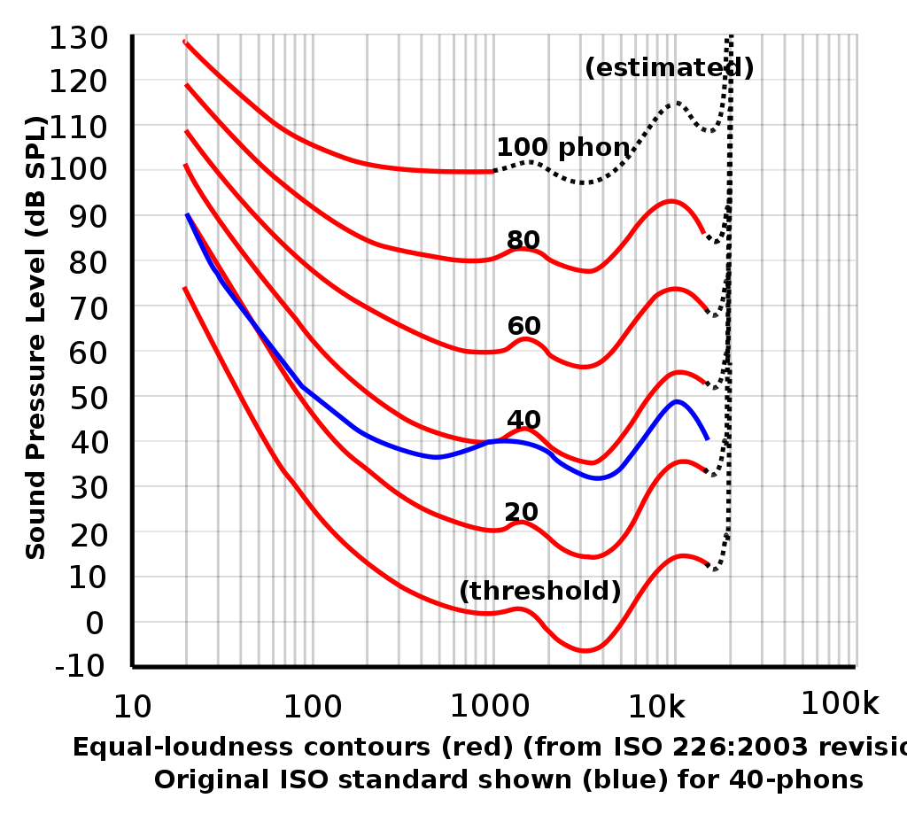

# 语音信号处理

## 一、绪论

### 1 技术

数字滤波器、快速傅里叶变换（FFT）、动态时间规整（DTW）、线性预测技术（LPC）、隐马尔科夫模型法（HMM）、矢量量化（VQ）、人工神经网络（ANN）

### 2 领域

- 语音识别：隐马尔科夫，ANN；说话人识别&语种辨识&情感信息

- 语音合成：合成策略：基因同步叠加法（PSOLA）

- 抗噪声技术

## 二、基础知识

### 1 语音系统

#### 1.1 发音系统

- 三种作用
  - 音源：肺部呼出
  - 音色：共振和反共振
  - 辐射：嘴唇、鼻孔
- 基因周期/基因频率：声带震动周期，声带开合周期

#### 1.2 听觉系统

- 人耳结构
  - 外耳：声源定位，声音放大
  - 中耳：线型传递；特强声音时非线性以保护内耳
  - 内耳：耳蜗，机械变换，神经信号，科蒂氏器官（传感器，纤毛细胞：按照频率感受而排列位置）
- 特性
  - 选择性：20~20kHz; -5~130dB; 其余在信号处理中可忽略
  - 时频分析：耳蜗=频谱分析仪
  - 掩蔽效应：同时掩蔽 + 短时掩蔽（向前、向后）

### 2 语音生成的数学模型

特性：非线性；非平稳随机过程 - 参数随时间变化（t）但特性变化缓慢- 分段采用线性时不变模型

- 激励振动：声门以下，声门子系统
- 声道系统：声门到嘴唇的呼吸道
- 辐射系统：嘴唇及以外

完整的语音信号数学模型 = 激励模型 × 声道模型 × 辐射模型
$$
H(z) = A \cdot U(z) \cdot V(z) \cdot R(z)
$$

#### 2.1激励模型

- 浊音激励：声带张开关闭 -> 类似斜三角脉冲 -> 以基因周期为周期的斜三角脉冲串
  $$
  g(n)=
  \begin{cases}
  (1/2)[1-cos(\pi n/N_{1}], &0\le n \le N_{1}\\
  cos(\pi(n-N_{1})/2N_{2}, &N_{1} \le n \le N_{1}+N_{2}\\
  0, &ifnot
  \end{cases}
  $$
  $N_1$为上升时间，$N_2$为下降时间。

  

  作图：`triangleOnde_in_notes.m`

  因此，斜三角波串 = 单位脉冲×单个斜三角波。也就是说，浊音激励波是一个以基音周期为周期的斜三角脉冲串。
  $$
  U(z)=G(z)E(z)=\frac{A_v}{1-z^{-1}} \cdot \frac{1}{(1-e^{-eT}z^{-1})^{2}}
  $$

- 清音激励：声道被阻碍形成湍流

  随机白噪声的z变换 -> 一般使用均值为0，方差为1，并在时间、幅值上为白色分布的序列

更多对于浊辅音等的建模：叠加激励；自适应激励……

#### 2.2 声道模型

**声管模型（早期）**：多个等长不同截面积的管子串联

**共振峰模型**：谐振腔

共振峰=谐振腔的谐振频率

一般来说，一个元音$=$前3个共振峰；复杂辅音$\geq$前5个以上的共振峰

- 均匀断面的声管共振频率：$F_{i}=\frac{(2i-1)c}{4L}$
  其中$i = 1,2,...$为正整数，也是共振峰序号。c为声速。L为声管长度
- 发元音e的时候，声道开头最接近均匀断面，所以共振峰最接近$F_{1,2,3}$。但发其他音，声道形状很少是均匀断面

3种实用的共振峰模型：

- 级联型

  一般元音

  全极点 -> 分解为二阶谐振器串联（传递函数相乘×）
  $$
  V(z)=\frac{G}{1-\sum_{k=1}^{N}{a_{k}z^{-k}}}=\prod_{k=1}^{M}\frac{a_i}{1-b_iz^{-1}-c_iz^{-2}}
  \\[10pt]
  c_i=-e^{-2{\pi}B_iT}
  \\
  b_i=2e^{-\pi B_i T}cos(2\pi F_i T)
  \\
  a_i=1-b_i-c_i\\
  G=a_1 a_2 a_3...a_M
  $$
  级数取决于声道长度，一般成年人声道长17cm，取3~5级即可。
  
- 并联型

  非一般元音和大部分辅音；鼻化元音、阻塞音、摩擦音；鼻腔参与共振

  零极点 -> 分解为二极点并联（传递函数相加+）
  $$
  V(z) = \frac{\sum^R_{r=0}{b_r z^{-r}}}{1-\sum^N_{k=1}{a_k z^{-k}}}=\sum_{k=1}^{M}\frac{a_i}{1-b_iz^{-1}-c_iz^{-2}}
  \\
  $$
  每个共振峰都可以独立调节

- 混合型

  结合串联和并联型，较为完备

  

#### 2.3 辐射模型

表征口唇和辐射效应，包括圆形头部的衍射效应
$$
辐射阻抗Z_L = \frac{声道模型输出的速度波u_L(n)}{语音信号声压波p_L(n)}
$$
认为口唇张开面积 << 头部表面积，可近似为平板开槽辐射

近似一阶高通 $R(z) = R_0 (1-z^{-1})$

### 3 语音基本参数

#### 3.1 声压与声强

- 声压：定量描述声波的最基本物理量，是由于声扰动产生的压强

  - 设语音长度$T$，离散点数$N$，语音信号为$x$，瞬时声压长度为$\Delta{t}$，则有效声压为
    $$
    p_e = \sqrt{\frac{1}{T} \sum^N_{n=1}{x^2 \Delta{t}}} = \sqrt{\frac{1}{N} \sum^N_{n=1}{x^2}}
    $$

  - 声压级：Sound Pressure Level (SPL) 与基准声压之比
    $$
    L_p = 20 \log_{10}{\frac{p_e}{p_{ref}}}
    $$

  - 空气中参考声压 $p_{ref}$ 取$2 \times 10^{-5} \operatorname{Pa}$

- 声强：声波单位时间内作用在传递方向垂直单位面积上的能量

  - 声强级：Intensity Level (IL)

  - 人耳对声强的感觉大致成对数比：$L_I = 10 \log_{10}(I/I_0)$ 单位分贝(dB)

  - 声学常用 $I_0 = 1 \times 10^{-12} \operatorname{W/m^2}$

- 声压与声强的关系
  - 对于球面波和平面波 $I = P^2 / \rho \cdot c$
  - $\rho$ 空气密度，$c$ 声速
  - 标准大气压20摄氏度，$\rho \cdot c = 408$ 该数值叫瑞利，称为空气对声波的特性阻抗

#### 3.2 响度

人耳主观感觉量，与声压和频率有关

定义：0dB 声压级的 1kHz 纯音响度级 = 0 phon

查表：等响度曲线

#### 3.3 频率与音高

频率：物理量Hz

音高：心理量Mel scale 对应 $ \operatorname{mel} = 2595 \log_{10}(1+\frac{f(Hz)}{700})$

### 4 语音数字化和预处理

语音信号 -> 带通滤波器 -> 自动增益控制(AGC) -> 模数转换(A/D) -> 脉冲编码调制(PCM) -> 计算机储存

- 预滤波
  - 防混叠，滤去 $> \frac{f_s}{2}$ 的部分
  - 去 50Hz 工频干扰
  - 带通滤波器，一般 $f_s=8kHz, f_H=3.4kHz, f_L=60~100Hz$
- A/D转化
  - 量化误差，量化信噪比
  - 量化字长常用12bit
- 预加重与去加重
  - 高频信噪比不足，故发送端对高频分量提升，接收端解调后对高频分量压低
  - 常用一阶高通滤波器

### 5 应用领域

- 语音增强
  - 抗噪
  - 算法：噪声对消法、谐波增强法、基于参数估计的语音再合成法、基于语音短时谱估计的增强算法
- 语音编码
  - 压缩，使表达语音的比特数最小
  - 编码类型：波形编码、参量编码、混合编码
- 语音合成与转换 Text2Speech
  - 文字序列 -> 音素序列 -> 语音波形
  - +语言学
- 语音隐藏
  - 将特定的信息嵌入到数字化语音中，隐藏信息的存在性（不同于加密：隐藏信息的内容）
  - 算法：回声隐藏算法、相位编码算法、扩频算法、Patchwork算法、标量量化算法
- 语音识别
  - 模式匹配法：训练（创建语音模板库）+识别（比较相似度）
  - 重点区别于说话人识别：将不同人话说的差异归一化
- 说话人识别
  - 识别类型：文本有关、文本无关、文本提示
  - 方法：模板匹配、概率模型法、人工神经网络

- 声源定位
  - 声源数目估计+声源定位+声源增强
- 情感识别
  - 提取特点：时间构造、振幅构造、基频构造、共振峰构造

## 三、常用算法

### 3.1 矢量量化

### 3.2 隐马尔科夫

### 3.3 人工神经网络

